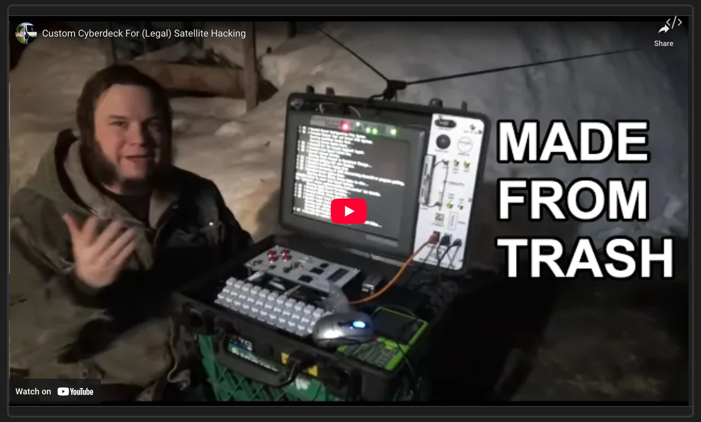

### Tab: Iframe Player

- **Description**: A highly reusable and responsive media player designed to embed and display content from various social media platforms. It intelligently applies platform-specific styling to create an optimized viewing experience and is now built to be fully reusable by accepting the content initialUrl as a prop.

- **Does**:
    - **Reusable & Prop-Driven**: Can be easily embedded multiple times by passing a different initialUrl prop to each instance, allowing it to display any supported web content.
    - **Platform-Specific Iframe Styling**: Automatically applies a set of pre-configured "guidelines" (dimensions, scale, positioning) to the iframe based on its source URL. This creates a tailored, often mobile-like, viewing experience for platforms like YouTube, Instagram, TikTok, and X.
    - **Responsive Scaling**: The player and its iframe content are fully responsive. When the container size changes, it automatically rescales the iframe while maintaining the correct aspect ratio defined by the platform guidelines.
    - **URL Transformation**: Automatically transforms standard media URLs into the correct embed format required by platforms like YouTube, using youtube-nocookie.com for enhanced privacy.
    - **Smart Fallback for Playback Issues**: Includes a mechanism to detect potential playback problems (like YouTube's "Error 153" which occurs in app:// contexts). After a short delay, it provides a convenient "Open in Browser" button as a fallback to ensure the user can always access the content.

- **Can’t**:
    - **Guarantee Playback within Obsidian**: Due to security restrictions within the app:// protocol used by Obsidian, some embedded content (most notably YouTube) may be blocked from playing directly inside the iframe and will require using the "Open in Browser" fallback.
    - **Auto-Detect New Platforms**: The styling "guidelines" are hard-coded. It cannot create an optimized view for a new, unknown website and will use a default layout for any unrecognized URL.
    - **Provide Playback Controls**: The component is a wrapper for the platform's native embed player. It does not offer its own custom controls for play, pause, volume, etc.; all interaction happens within the embedded iframe.
    - **Persist Manual Adjustments**: While previous versions had a debug menu for adjusting iframe dimensions, this reusable version does not. All styling is determined by the pre-configured guidelines.

----




### Runner

```datacorejsx
const activeFile = dc.resolvePath("IFRAME PLAYER") || "_RESOURCES/DATACORE/IFRAME PLAYER/IFRAME PLAYER";
const folderPath = activeFile.substring(0, activeFile.lastIndexOf('/'));
const { View } = await dc.require(folderPath + "/src/index.jsx");
return <View folderPath={folderPath} dc={dc} initialUrl="https://www.youtube.com/embed/bsL7ZnKIAhs" />;
```
